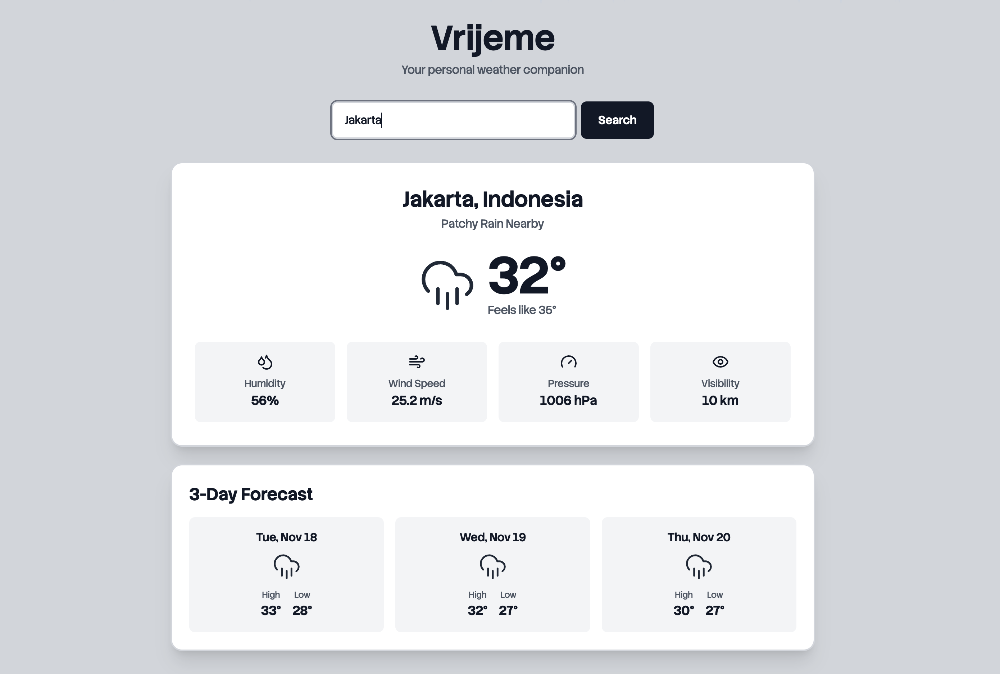
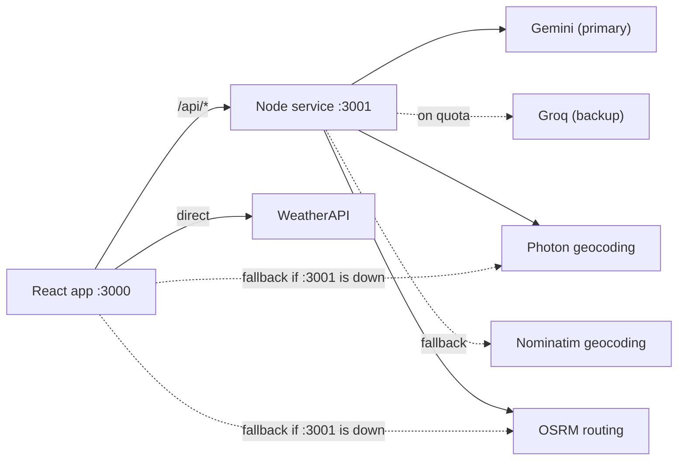

<h1 align="center">Aether 🌦️</h1>

<p align="center">
  <strong>A weather app that doesn't just tell you it's raining — it tells you which way to drive to avoid it.</strong>
</p>

<p align="center">
  
  
  
  
</p>

<!-- Screenshot goes here. Drop a PNG at public/image.png and uncomment:
<p align="center"></p>
-->

---

## What is this?

**Aether** started life as *Vrijeme* (Bosnian/Croatian/Serbian for "weather" — hence the package name) and grew into something bigger: a weather dashboard with an AI assistant bolted on, backed by a small Node service.

The headline feature is **rain-aware routing**. Ask the chat *"best route from my place to Grand Indonesia, will it rain?"* and Aether will geocode both ends, pull up to three driving alternatives, sample the weather along each one, and recommend the driest — drawn on a live map with radar overlay.

Everything is built on free, no-credit-card APIs.

---

## ✨ Features

| | |
|---|---|
| 🗺️ **Rain-aware routing** | Compares up to 3 driving routes, scores each for rain, recommends the driest |
| ⏱️ **Judged at arrival time** | Each stretch is checked against the forecast for the hour you'd actually reach it — say "at 6pm" to plan ahead |
| 🌡️ **Rain heat map** | The route is drawn stretch by stretch — green where it's dry, red where rain is forecast |
| 🔀 **Switchable routes** | Tap any alternative to draw it instead and see its own rain breakdown |
| 📍 **Asks before it guesses** | When a name matches several places, it lists them with distances and lets you pick |
| 🔗 **Google Maps links** | Paste any Maps URL — including `maps.app.goo.gl` short links — as a destination |
| 💬 **AetherAI chat** | Ask about weather anywhere, set reminders, get directions — in plain English |
| 📡 **Live radar map** | Leaflet map with RainViewer precipitation overlay, routes coloured by rain risk |
| ⏰ **Weather reminders** | "remind me at 5pm to bring an umbrella" — persisted and scheduled locally |
| 🌡️ **Rich conditions** | Feels-like, humidity, dew point, pressure, visibility, cloud cover, gusts |
| 📅 **Forecasts** | Next 12 hours + 3-day outlook |
| ☀️ **UV & air quality** | Live UV index with daily max, plus US EPA air quality index |
| 🎨 **Dynamic UI** | Backgrounds, icons and animations shift with conditions and time of day |
| 💾 **Remembers you** | Last city restored from `localStorage` on return |
| 📱 **Responsive** | Mobile through desktop |

---

## 🏗️ How it fits together

Two processes: the React app (`:3000`) and a small Node service (`:3001`). In development, CRA proxies `/api` → `:3001` via the `proxy` field in `package.json`.



**Why a backend at all?** Three reasons: it keeps AI keys off the client, it sends the geocoders the polite `User-Agent` their usage policies require, and it can retry upstream calls server-side without tripping browser rate limits.

**Everything degrades instead of breaking.** The backend is optional — if `:3001` is down, the frontend calls the geocoder and OSRM directly. If the AI has no keys or is rate-limited, chat falls back to a local deterministic assistant that still answers from loaded weather data. Geocoding tries four tiers (proxy → Photon → Nominatim → WeatherAPI search) before giving up.

### The interesting bits

<details>
<summary><strong>How rain scoring picks a route</strong></summary>

Two things make this more than "is it raining right now".

**Rain isn't uniform over a route.** [`RouteService.js`](src/services/RouteService.js) cuts each alternative into contiguous chunks (3–8, scaled by length) and judges each one separately. That's what the map draws: **one colour per stretch of road**, so a shower halfway along shows up as a red band with green either side. A route reads as bad as its worst stretch — one downpour still means taking an umbrella.

**Rain isn't uniform over time either.** The far end of a 40-minute drive is 40 minutes away, so asking about it *now* answers the wrong question. Each chunk is checked against the **hourly forecast at the hour you'd actually reach it**:

- OSRM is asked for `annotations=duration` — its own per-node timings — so the ETA for each stretch follows real road speeds. On a Jakarta→BSD run the three chunks land at +4, +12 and +26 minutes, not the evenly-spaced +5/+16/+27 a constant-speed guess would produce.
- That instant picks an hour out of WeatherAPI's hourly forecast (matched on `time_epoch`, a true UTC instant, so timezones don't enter into it).
- Say `route to X at 6pm` and the whole timeline shifts to a 6pm departure.

Each chunk's verdict weighs amount *and* probability, because they answer different questions — "40% chance, 0mm" means it might rain and probably won't amount to much:

```
not falling, <30% chance, ≤0.2mm  → dry    (green)
≥0.5mm expected, or ≥60% chance   → wet    (red)
otherwise                         → light  (yellow)
```

To rank alternatives, the score is *averaged*, not summed:

```
score = mean precipitation (mm) + mean chance of rain
```

Summing would punish long routes: they get more samples, so they'd always look wetter than a short route in identical weather. Chunk counts are capped at 8 because each chunk is one WeatherAPI call, times every alternative.

If a stretch's ETA lands past the forecast horizon, or the lookups fail, that stretch reports `unknown` — it never quietly becomes "dry".

"Precipitation is falling" is decided by WeatherAPI's condition **code** (`≥ 1150`), never by matching the word "rain" in the label. Code 1063 is *"Patchy rain nearby"* — rain **around** the point, not on it — and it's the default daytime condition across much of the tropics. Counting it marked every route wet. Matching text also misses drizzle and sleet, whose labels never say "rain".

If every sample fails, the route reports `unknown` rather than scoring 0 and promising a dry trip nobody checked.
</details>

<details>
<summary><strong>How the AI failover works</strong></summary>

[`server/index.js`](server/index.js) treats Gemini and Groq as interchangeable. On a quota or rate-limit error (`429`, `402`, or a matching message) the exhausted provider is sidelined for a cooldown (default 30 min) and the request retries on the backup. It also tracks per-provider daily token usage, enforces optional budgets, trims history to the last 6 turns, and caps replies at 300 tokens. Live stats are exposed at `/api/usage` and surfaced in the chat's usage panel.
</details>

<details>
<summary><strong>How chat understands you</strong></summary>

Intent parsing is deterministic and runs *before* any AI call — [`intents.js`](src/chat/intents.js) and [`assistant.js`](src/chat/assistant.js) use plain regex to recognise routing, weather-in-a-place, and reminder requests. Only genuinely open-ended messages reach the LLM. It's cheaper, instant, and works offline.
</details>

<details>
<summary><strong>How it decides where you meant</strong></summary>

A place name is rarely unique. "Grand Indonesia" matches the mall, its sky bridge, and an estate agent's office 27km away — so [`GeoService.js`](src/services/GeoService.js) returns a *ranked list* rather than a single guess.

- **One match** → route straight there.
- **Several** → the chat asks, listing each with its distance from your origin. Candidates within 150m of each other are collapsed, since a mall and its own footbridge aren't a real choice.
- **None, or none of them right** → paste a Google Maps link. Full URLs are parsed client-side; `maps.app.goo.gl` short links carry no coordinates, so [`/api/resolve`](server/index.js) follows the redirect server-side (the browser can't read a cross-origin one). Only Google map hosts are followed.

</details>

---

## 🚀 Getting started

### Prerequisites

- **Node.js 18+** (developed on v24)
- A free [WeatherAPI.com](https://www.weatherapi.com/) key — required
- Optionally, a [Gemini](https://aistudio.google.com/app/apikey) and/or [Groq](https://console.groq.com/keys) key for AI chat

### 1. Clone and install

```bash
git clone https://github.com/albertleooonardi/aether.git
cd aether
npm install
```

### 2. Configure

```bash
cp .env.example .env
```

Then open `.env` and add your keys. **Only `REACT_APP_WEATHER_API_KEY` is required** — without it, no weather loads. Everything else is optional; leave the AI keys blank and chat quietly uses the local assistant.

> `.env` is gitignored. Keep it that way — never commit real keys.

### 3. Run

You need **two terminals**:

```bash
npm run server   # terminal 1 → Node service on :3001
npm start        # terminal 2 → React app on :3000
```

Open **http://localhost:3000**.

> Running the frontend alone works too — you lose AI chat, and geocoding/routing fall back to direct calls.

<details>
<summary><strong>Port 3001 already in use?</strong></summary>

```bash
lsof -ti :3001 | xargs kill    # free it
PORT=3002 npm run server       # or run elsewhere
```
Note that CRA's `proxy` in `package.json` points at `3001`; update it if you move the port.
</details>

---

## ⚙️ Environment variables

**Frontend** (must be prefixed `REACT_APP_`, baked in at build time):

| Variable | Required | Description |
|---|---|---|
| `REACT_APP_WEATHER_API_KEY` | **Yes** | WeatherAPI.com key — the app can't load weather without it |

**Backend** (`server/index.js`, all optional):

| Variable | Default | Description |
|---|---|---|
| `GEMINI_API_KEY` | — | Enables Gemini. Blank = provider skipped |
| `GEMINI_MODEL` | `gemini-flash-lite-latest` | Gemini model id |
| `GROQ_API_KEY` | — | Enables Groq. Blank = provider skipped |
| `GROQ_MODEL` | `llama-3.1-8b-instant` | Groq model id |
| `AI_PRIMARY` | `gemini` | Which provider leads (`gemini` or `groq`) |
| `AI_MAX_OUTPUT_TOKENS` | `300` | Reply length cap |
| `AI_HISTORY_TURNS` | `6` | Conversation turns sent as context |
| `AI_COOLDOWN_MS` | `1800000` | How long a rate-limited provider is sidelined |
| `GEMINI_TOKEN_BUDGET` | `0` | Daily token cap (`0` = unlimited) |
| `GROQ_TOKEN_BUDGET` | `0` | Daily token cap (`0` = unlimited) |
| `PORT` | `3001` | Backend port |

---

## 📜 Scripts

| Command | Does |
|---|---|
| `npm start` | React dev server on `:3000` |
| `npm run server` | Node backend on `:3001` |
| `npm run build` | Production bundle into `build/` |
| `npm test` | Jest in watch mode (`CI=true npm test` to run once) |

---

## 🔌 API reference

| Endpoint | Returns |
|---|---|
| `GET /api/health` | Service status and which AI providers hold keys |
| `GET /api/usage` | Per-provider token usage, budgets, cooldowns |
| `GET /api/geocode?q=…&near=lat,lon` | Ranked candidate list for a place. `near` biases results toward the user |
| `GET /api/resolve?url=…` | Coordinates from a Google Maps link, following short links. Google map hosts only |
| `GET /api/route?from=lat,lon&to=lat,lon` | OSRM driving routes with alternatives |
| `POST /api/chat` | `{ messages, context }` → AI reply with provider metadata |

---

## 📁 Project structure

```
src/
├── App.js                  # State, data flow, layout
├── chat/
│   ├── assistant.js        # Local fallback assistant + reminder parsing
│   └── intents.js          # Deterministic intent recognition
├── components/
│   ├── chat/               # Chat widget, route map, usage panel
│   └── …                   # Weather cards, forecasts, UV, wind, animations
├── services/
│   ├── AetherAI.js         # Backend chat client
│   ├── GeoService.js       # Geocoding (Photon → Nominatim → WeatherAPI)
│   ├── RouteService.js     # Routing + rain assessment
│   ├── WeatherService.js   # WeatherAPI client
│   └── StorageService.js   # localStorage persistence
└── utils/                  # Icons, theming, time helpers

server/
└── index.js                # AI failover + geocode/route proxies (no deps but dotenv)
```

---

## ⚠️ Known limitations

- **No live traffic.** This is the big one. OSRM's public server routes on free-flow OSM speeds, so its durations are optimistic in a congested city — and since rain is judged at your ETA, a wrong ETA asks the forecast the wrong question. A 30-minute estimate that's really 50 in Jakarta traffic checks the wrong hour at the far end. A traffic-aware provider (Mapbox `driving-traffic`, TomTom, Google Directions — all need a key) would drop straight in: it only has to return durations, and everything downstream is unchanged.
- **OSRM public demo server** — free and unmetered, but rate-limited and offers no uptime guarantee. Self-host OSRM for anything serious.
- **POI coverage is only as good as OSM.** Photon handles named landmarks well and searches are biased toward your location, but a place missing from OpenStreetMap can't be found by either geocoder. Adding the city name helps.
- **Radar tops out at zoom 7.** RainViewer's free tiles don't exist above z7, so on a city-scale route the overlay is an upscaled — and visibly coarse — approximation. That's the real resolution of the data, not a rendering bug.
- **Rain sampling is still a heuristic** — a handful of points per route against an hourly forecast. Forecasts are wrong sometimes, an hour is a coarse bucket for a fast-moving tropical squall, and a chunk speaks for the road either side of it. Good for "should I take an umbrella", not for meteorology.
- **API keys are build-time.** `REACT_APP_*` values are embedded in the bundle, so a deployed frontend's WeatherAPI key is public. Restrict it at the provider, or proxy it through the backend.

---

## 📄 License

MIT.

## 🙏 Acknowledgements

[WeatherAPI](https://www.weatherapi.com/) · [Photon](https://photon.komoot.io/) · [OpenStreetMap Nominatim](https://nominatim.org/) · [OSRM](https://project-osrm.org/) · [RainViewer](https://www.rainviewer.com/) · [Leaflet](https://leafletjs.com/) · [Lucide](https://lucide.dev/)
